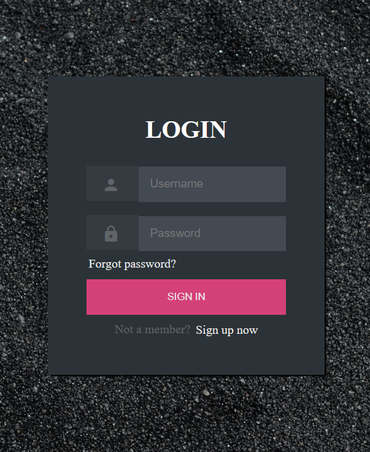
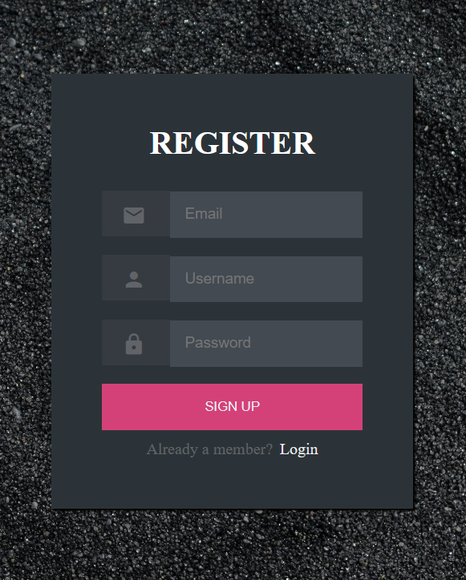
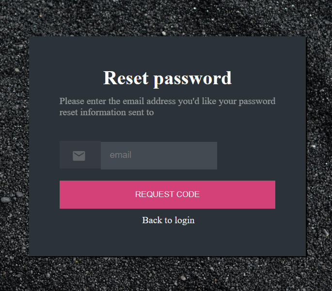

# Simple Login and Registration Page
This project is a straightforward implementation of a login and registration system using HTML and CSS.

## Table of Contents

- [Screenshots](#screenshots)
- [License](#license)

## Screenshots
### 1. Login page

This screenshot displays the main login page. Users can enter their username and password in the respective fields.

### 2. Register page

The register page allows new users to sign up for an account. It includes fields for entering essential information such as username, email, and password.

### 3. Forgot password page

In this screenshot, you can see the "Forgot Password" page, accessible via the link below the login form. Users can navigate here to reset their passwords by providing their email address. The page follows the same clean design principles as the login page.

## License
This project is open-source and is licensed under the MIT License. Feel free to explore, use, and contribute!
